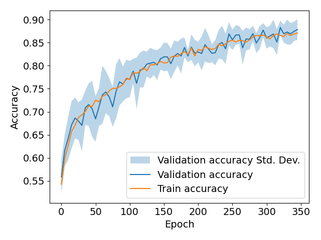

# LostPaw: Finding Lost Pets using a Contrastive Learning Transformer

This project is a study on the use of artificial intelligence in identifying lost pets. Specifically, we trained a contrastive neural network model to differentiate between pictures of dogs and evaluated its performance on a held-out test set. The goal of this project is to explore the potential of AI in the search for lost pets and to discuss the implications of these results. The project includes code for the model training and evaluation, but not the data used in the study. However, we do provide the scripts used to acquire the data.

# Requirements
The following dependencies are required to run this project:

* Python 3.7 or higher
* Torch 1.13 or higher 
* NumPy
* Pandas
* Transformers
* Timm
* Wandb
* Tqdm
* Pillow

# Getting Started

To get started with this project, you can clone the repository to your local machine and install the required dependencies using pip:

```bash
pip install --upgrade pip
pip install -e .
```

Once the dependencies are installed, you can run the code to train and evaluate the model (make sure the data is available):

```bash
python scripts/train.py -c lostpaw/configs/default.yaml
```

# Results


* Achieved an average F1-score of 88.8% on the cross-validation set.
* Validation accuracy closely followed the train accuracy, indicating no overfitting.
* The loss value steadily dropped from 1.16 to 0.04 during training suggesting the model learned an effective representation of the data.
* These results suggest the contrastive learning model can make accurate decisions on unseen samples.

# Dataset
As we do not have the rights to publish the data, we recommend that the user obtains their own images and places them in a desired folder. In this case, please update the `info_path` flags during training. This can either be done by supplying additional flags to the training script, or by creating a new config.yaml file:
```
python scripts/train.py -c lostpaw/configs/default.yaml --info_path "output/data/train.data"
```

The `info_path` flag requires a file that contains rows of image entries, which have a format similar to the following:

```json
{"pet_id": "35846622", "paths": ["output/data/35846622/0.jpg", "output/data/35846622/1.jpg", "output/data/35846622/2.jpg"]}
{"pet_id": "35846624", "paths": ["output/data/35846624/0.jpg", "output/data/35846624/1.jpg", "output/data/35846624/2.jpg"]}
``` 

The `paths` key can contain as many image paths as you desire, where each path should point to a different augmentation of the same image. For different images per pet include multiple entries with the same `pet_id`.

# Webapp Demo
Our project aims to make a contrastive learning model available to a broader audience by developing a user-friendly web application. The web application, developed with HTML, CSS, and JavaScript, is accessible from any device with a web browser, allowing users to upload pictures of their pets and find similar pets in the system. Once the uploaded image is processed by the contrastive learning model, the web application returns a list of pets with their similarity score.

Future implementations of the web application can include features that restrict the search to a specific area or search pets based on breed, size, or other criteria. This can be useful for people who are trying to find lost pets or for those who are looking to adopt a pet. Overall, our web application is a convenient tool that makes use of the power of contrastive learning to help users identify and find pets.

The webapp requires `node`, with an `npm` version of at least 9.2.0. In the current version, the demo only supports the following:

- **Login using OIDC:**
    - Navigate to login page.
    - Use OpenID connect to authenticate.
        - Get redirect URL from backend.
        - User gets redirected.
        - Once user gets back, forward `state` and `code` to backend and get
          session token.
    - Cache session token to stay logged in.
- **Report missing pet:**
    - Click big plus button found on the bottom right of the map
    - Select "Report missing"
    - Popup appears
    - Add image to form
    - Send form to backend
    - Missing is sent to Rust backend for processing
    - Once the pictures have been processed, the mean embedding is computed and searched against known pets.
    - Embedding is saved in memory and compared against new found pets.

As described earlier, the demo will only allow users to submit an image of a pet, and will only compare the resulting latent space with other latent spaces already available in the system. Before running the demo, make sure that a few pet images are available in the `webapp/backend/example_pets` folder. The Rust backend will parse this folder in order to calculate latent spaces that will be used to compare any incoming image.

To run the front-end:
```bash
cd webapp/frontend
npm run dev
```

To run the back-end (make sure `webapp/backend/example_pets` exists!):
```bash
cd webapp/backend
cargo run
```

# Resources
A project created for the "High Tech Systems and Materials" Honours Master's track at the University of Groningen.

* Encoding of pet images: [ViT Base, patch 16, size 384](https://huggingface.co/google/vit-base-patch16-384)
* Pet recognition: [DETR ResNet 50](https://huggingface.co/facebook/detr-resnet-50)
* [Contrastive loss](https://ieeexplore.ieee.org/abstract/document/1640964)
